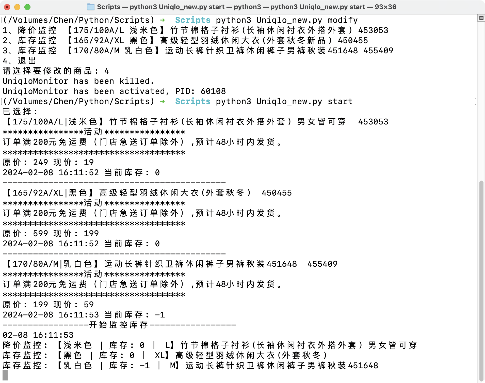

# UniqloMonitor
*目前仅支持中国大陆的线上优衣库商城

#### Python版本(>= 3.5)

#### 已有功能
  - [x] 商品真实库存查询
  - [x] 库存监控
  - [x] 降价监控

#### TODO
  - [ ] 推送通知逻辑优化
  - [ ] 多应用推送支持
  - [ ] 添加商品逻辑优化

#### 依赖库安装

`pip install requests`

#### 使用方法
`python3 uniqlo.py`

#### 预览效果
+ 添加商品

+ 商品监控

+ Bark推送结果

